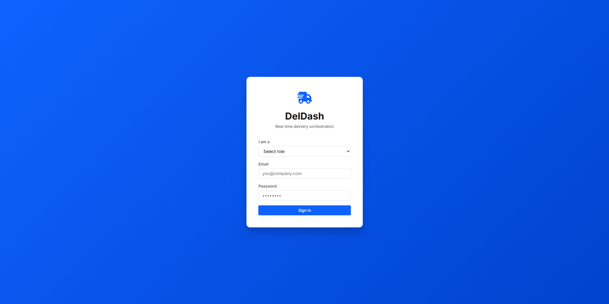
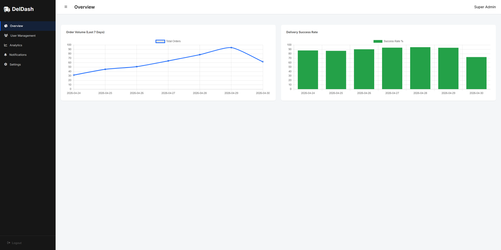
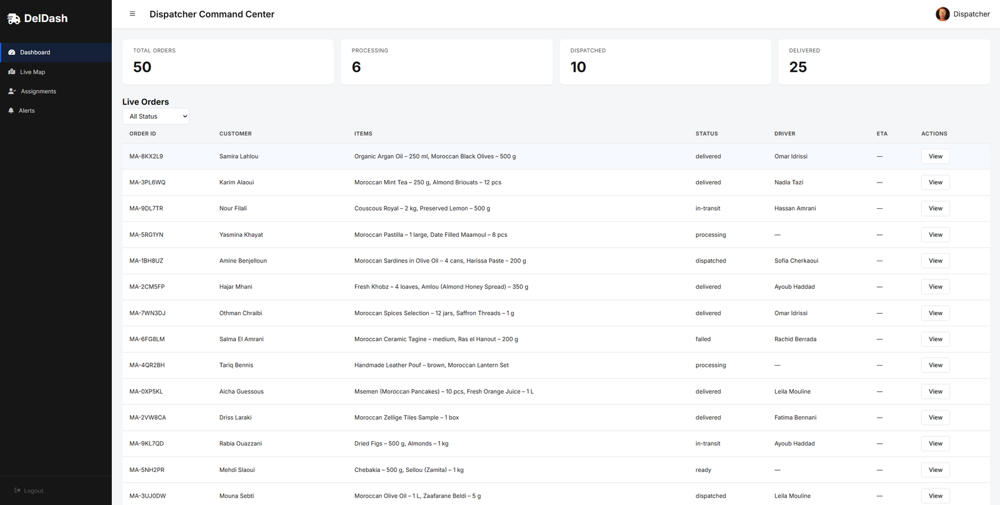
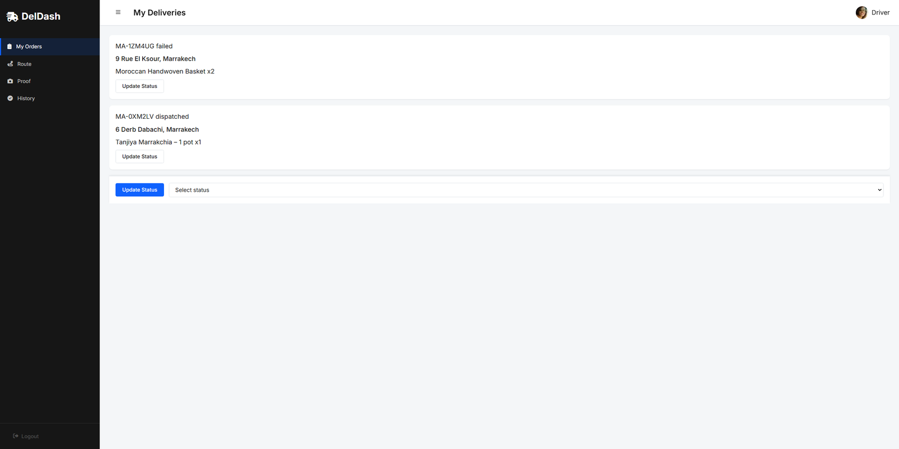
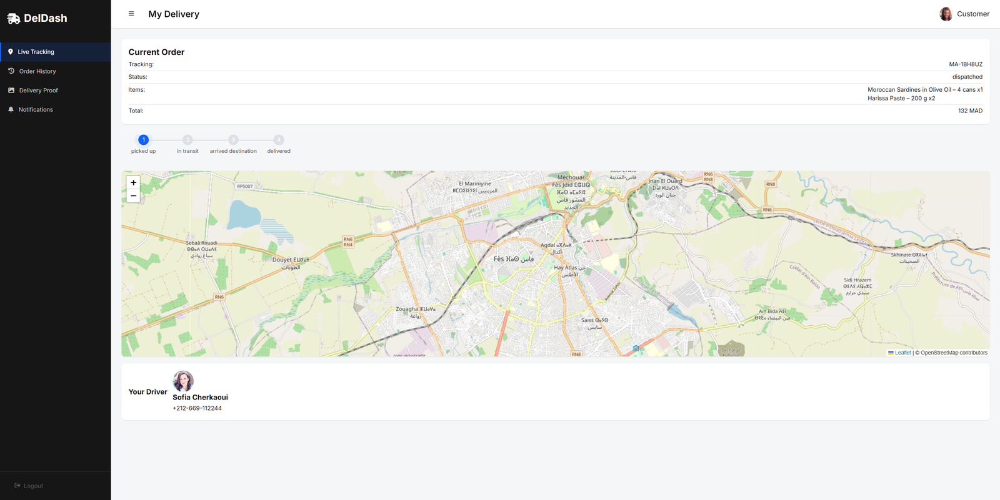

# 🚚 DelDash — Delivery Dashboard

> Plateforme web de gestion et de suivi de livraisons en temps réel, avec un tableau de bord dédié à chaque rôle : **Super Admin**, **Dispatcher**, **Livreur** et **Client**.

**🔗 Démo en ligne : https://aboudouali1957-crypto.github.io/deldash/**


---

## 📸 Aperçu

| Connexion | Super Admin |
|---|---|
|  |  |

| Dispatcher | Livreur | Client |
|---|---|---|
|  |  |  |

---

## 🔑 Comptes de démonstration

| Rôle | Email | Mot de passe |
|---|---|---|
| Super Admin | `del-admin@deldash.ma` | `admin123` |
| Dispatcher | `m.zahiri@deldash.ma` | `disp456` |
| Livreur | `a.jabri@deldash.ma` | `driver9` |
| Client | `a.benjelloun@email.ma` | `cust5` |

Sur la page de connexion, choisir le rôle, puis saisir l'email et le mot de passe correspondants.

---

## ✨ Fonctionnalités

### 👑 Super Admin
- Gestion des utilisateurs (liste, ajout, modification, suppression)
- Tableau de bord analytique avec graphiques (Chart.js)
- Centre de notifications
- Paramètres de la plateforme

### 🧭 Dispatcher
- Vue des commandes en cours, mise à jour en direct
- Affectation des commandes aux livreurs
- Carte interactive des livraisons (Leaflet)

### 🛵 Livreur
- Liste des commandes assignées et des livraisons terminées
- Carte de l'itinéraire
- **Preuve de livraison** : photo prise avec la caméra du téléphone (API `getUserMedia`) ou image importée, puis commande marquée comme livrée

### 📦 Client
- Suivi de la commande en temps réel avec estimation de l'heure d'arrivée (ETA)
- Historique des commandes
- Consultation de la preuve de livraison
- Notifications

### ⚙️ Transversal
- Authentification par rôle avec redirection vers le bon tableau de bord
- Interface responsive (sidebar repliable sur mobile)
- Application installable (**PWA** : `manifest.json` + Service Worker pour le cache hors-ligne)

---

## 🛠️ Stack technique

| Domaine | Technologies |
|---|---|
| Front-end | HTML5, CSS3, JavaScript (ES6+, vanilla, modules IIFE) |
| Cartographie | Leaflet.js |
| Graphiques | Chart.js |
| PWA | Web App Manifest, Service Worker (Cache API) |
| APIs navigateur | Fetch, localStorage, MediaDevices (caméra), FileReader, Canvas |
| Données | Fichiers JSON simulant une API (commandes, utilisateurs, véhicules, trajets…) |
| Déploiement | GitHub Pages |

---

## 📁 Structure du projet

```
deldash/
├── index.html              # Page de connexion
├── super-admin.html        # Dashboard Super Admin
├── dispatcher.html         # Dashboard Dispatcher
├── delivery-man.html       # Dashboard Livreur
├── customer.html           # Dashboard Client
├── manifest.json           # Configuration PWA
├── sw.js                   # Service Worker (cache hors-ligne)
├── css/                    # Styles globaux + un fichier par rôle
├── js/
│   ├── auth.js             # Connexion / déconnexion / session
│   ├── app.js              # Initialisation et navigation commune
│   ├── data-loader.js      # Chargement des données JSON
│   ├── live-tracking.js    # Suivi en temps réel (polling) + ETA
│   ├── map-utils.js        # Utilitaires Leaflet
│   ├── route-map.js        # Carte d'itinéraire du livreur
│   ├── driver-assignment.js# Affectation des livreurs
│   ├── delivery-proof.js   # Preuve de livraison (caméra / upload)
│   ├── analytics.js        # Graphiques Chart.js
│   ├── user-management.js  # CRUD utilisateurs
│   └── ...                 # Notifications, paramètres, etc.
├── data/                   # Données simulées (JSON)
└── lib/                    # Leaflet et Chart.js en local
```

---

## 🚀 Lancer le projet en local

Le projet charge des fichiers JSON avec `fetch`, il faut donc un petit serveur local (ouvrir `index.html` en double-cliquant ne suffit pas).

```bash
git clone https://github.com/aboudouali1957-crypto/deldash.git
cd deldash

# Option 1 : Python
python -m http.server 8000
# puis ouvrir http://localhost:8000

# Option 2 : extension "Live Server" de VS Code
```

---

## 🧠 Ce que j'ai appris

- Structurer une application multi-rôles en JavaScript sans framework
- Intégrer des cartes interactives et des graphiques avec des bibliothèques tierces
- Simuler une API REST avec des fichiers JSON et `fetch`
- Utiliser les APIs du navigateur : caméra, stockage local, Service Worker
- Déployer un site statique avec GitHub Pages

---

## 🔭 Pistes d'amélioration

- Back-end réel (Node.js / Express ou Laravel) avec base de données
- Authentification sécurisée (mots de passe hashés, JWT)
- Temps réel avec WebSockets au lieu du polling
- Tests automatisés

> ℹ️ Ce projet est une démonstration front-end : les données sont simulées et l'authentification se fait côté client.

---

## 👥 Auteurs

- **Ali Aboudou** — [GitHub](https://github.com/aboudouali1957-crypto)
- **Noureddine Abarhane**
